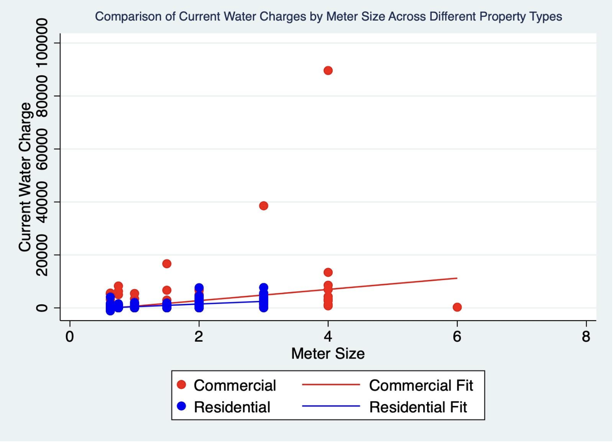
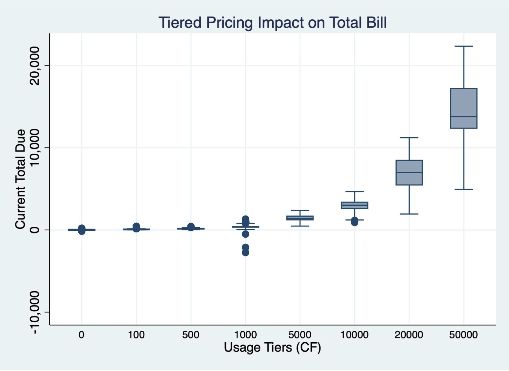
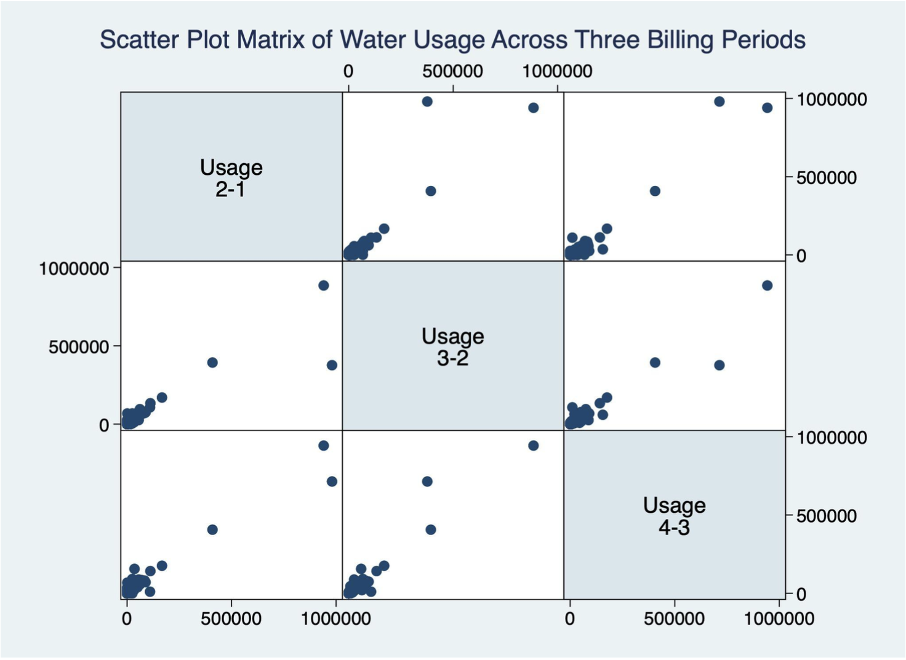

# City of Chelsea Water Usage Analysis

## Project Overview

This project investigates the water billing system in the City of Chelsea, MA, to assess whether pricing structures are equitable and efficient. We analyze relationships between water charges, meter sizes, usage tiers, and property types. The study uncovers potential evidence of tiered pricing, non-linear billing behavior, and property-type-specific discrepancies in charges, with recommendations for optimization.

---

## Goals and Objectives

- Detect Tiered Pricing: Identify whether higher water usage is charged disproportionately more.
- Assess Meter Size Impact: Examine the linear and non-linear effects of meter size on water charges.
- Evaluate Property Categories: Determine whether commercial vs. residential properties face unequal billing practices.
- Optimize Fairness and Efficiency: Recommend improvements to ensure fair water billing.

---

## Data Description

### Source

The dataset includes 4,966 account records from Chelsea's water billing system, containing:

- Meter characteristics (`MeterSize`, `MeterType`)
- Property descriptors (`PropertyType`, account categories)
- Water usage (`Usage21`, `Usage32`, `Usage43`, `CurrentMonthUsage`)
- Billing outcomes (`CurrentWaterCharge`, `CurrentTotalDue`)
- Discounts (`SeniorDiscount`)

### Cleaning & Feature Engineering

- Converted string-based `MeterSize` to numeric, replaced 0s with `NaN`
- Created a `NewSeniorDiscount` binary indicator
- Binned usage into `UsageCategory` (Low/Med/High) for tiered pricing analysis
- Built `AccountTypeNum` for regression (Residential = 0, Commercial = 1)
- Created usage difference variables for anomaly detection (`UsageDifference43`)
- Generated scatterplot matrix across usage time periods

---

## Key Visualizations

Recommended visualizations to include in your notebook and portfolio:

- Quadratic Regression Plot: `CurrentWaterCharge ~ MeterSize + MeterSize²`
- 
- Boxplot: `CurrentTotalDue` across `UsageCategory` (tiered pricing visualization)
- 
- Scatterplot Matrix: `Usage21`, `Usage32`, `Usage43` (identify seasonal anomalies)
- 

---

## Modeling & Analysis

### Regression Model (Stata)

This project includes a linear regression analysis conducted in **Stata** to examine how water usage, meter size, and property type influence billing amounts. The model evaluates the significance and impact of:

- `MeterSize` and its squared term (to capture non-linearity)
- `PropertyType` (residential vs. commercial)
- `SeniorDiscount` eligibility

---

## Key Findings and Stakeholder Takeaways

- **Non-linear Meter Size Charges**  
  Larger meters are associated with disproportionately higher charges, suggesting the presence of non-linear pricing. This may unintentionally penalize large-meter users—especially commercial properties—regardless of actual usage volume.

- **Evidence of Tiered Pricing**  
  Customers with higher water usage fall into dramatically more expensive billing brackets (e.g., over $14,000 vs. under $20 for low users). While this structure supports conservation, it may also raise equity concerns for large households or essential businesses.

- **Commercial vs. Residential Disparities**  
  Commercial properties consistently face significantly higher charges. However, there is substantial variation within this group, indicating a need for category-specific pricing policies that reflect business size and operational needs.

- **Usage Volatility Across Periods**  
  Some accounts show erratic consumption across billing periods (e.g., Usage43 vs. Usage32), which could indicate billing errors, leaks, or inconsistent meter reads. These cases should be flagged for maintenance or audit.

- **Senior Discounts Have Minimal Impact**  
  The `SeniorDiscount` variable shows no statistically significant effect on total charges, suggesting that the discount may be too small to matter, inconsistently applied, or overshadowed by usage-based charges.

---

## Actionable Recommendations

- **Review and Cap Tier Pricing for Large Meters**  
  Prevent unfair penalization of high-meter-size users who do not consume excessively.

- **Audit High-Variance Accounts**  
  Identify and assist customers with potential leaks or billing issues based on usage anomalies.

- **Enhance Rate Structure Transparency**  
  Clearly define how billing tiers, meter size, and property type interact, and publish this structure for public understanding.

- **Reevaluate Discount Programs**  
  Assess whether senior or other discounts are meaningful and equitably distributed, and consider automatic qualification systems where appropriate.

- **Use Data for Targeted Policy Adjustments**  
  Leverage findings to revise pricing strategies that better balance conservation, fairness, and revenue stability.

--

## Limitations

- **Missing/Zero Values**: Some accounts had missing or invalid meter size or usage data, which were excluded but may contain useful signals.
- **Lack of Time Series**: The dataset appears to be a snapshot in time. Without temporal data, seasonality and long-term trends cannot be analyzed.
- **Ambiguous Property Types**: Some `PropertyType` values were blank or ambiguous, limiting precise segmentation.
- **Potential Tier Jump Thresholds Unknown**: The dataset does not explicitly define where pricing tiers change, so thresholds had to be inferred.
- **Discounts Not Fully Explained**: The impact and eligibility for the `SeniorDiscount` variable is unclear from the metadata and shows weak effects.

---

## Future Directions

- **Add Time-Series Analysis**: Incorporate multi-month data to analyze seasonal usage trends and billing cycles.
- **Overlay Geospatial Mapping**: Visualize water usage and billing by neighborhood using zip code or coordinates.
- **Outlier Detection Model**: Automate detection of accounts with sudden usage spikes or atypical billing patterns.
- **Simulate Policy Changes**: Use modeling to test how billing rule changes (e.g., adding more usage tiers) would affect equity and revenue.
- **Equity Analysis**: Examine how billing impacts vary across property types and whether discounts are effective for low-income households.
- **Enhance Metadata**: Request or extract more metadata on meter types, rate schedules, or fixed service fees to enrich analysis.

